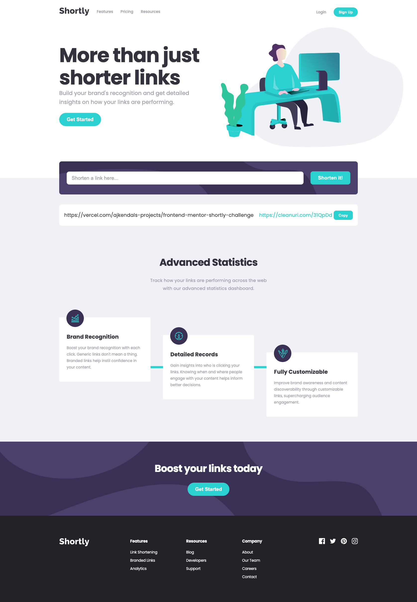

# Frontend Mentor - Shortly URL shortening API Challenge solution

This is a solution to the [Shortly URL shortening API Challenge challenge on Frontend Mentor](https://www.frontendmentor.io/challenges/url-shortening-api-landing-page-2ce3ob-G). Frontend Mentor challenges help you improve your coding skills by building realistic projects.

## Table of contents

- [Overview](#overview)
  - [The challenge](#the-challenge)
  - [Screenshot](#screenshot)
  - [Links](#links)
- [My process](#my-process)

  - [Built with](#built-with)
  - [What I learned](#what-i-learned)
  - [Useful resources](#useful-resources)

- [Author](#author)

## Overview

### The challenge

Users should be able to:

- View the optimal layout for the site depending on their device's screen size
- Shorten any valid URL
- See a list of their shortened links, even after refreshing the browser
- Copy the shortened link to their clipboard in a single click
- Receive an error message when the `form` is submitted if:
  - The `input` field is empty

### Screenshot



### Links

- Solution URL: [GitHub](https://github.com/ajkendal/frontend-mentor-shortly-challenge)
- Live Site URL: [Shortly Challenge](https://frontend-mentor-shortly-challenge.vercel.app/)

## My process

### Built with

- Semantic HTML5 markup
- SCSS custom properties
- Flexbox
- Mobile-first workflow
- [React](https://reactjs.org/)
- [Vite](https://vite.dev/)
- [Vercel](https://vercel.com/)
- [cleanuri.com](https://cleanuri.com/docs)

### What I learned

I encountered several Cross-Origin errors while implementing the API fetch call. However, I discovered that by using [https://corsproxy.io/](https://corsproxy.io/) in combination with the URL, I was able to successfully retrieve a response.

To see how you can add code snippets, see below:

```js
async function fetchShortenedUrl(url: string): Promise<string> {
  const apiUrl =
    'https://corsproxy.io/?' + 'https://cleanuri.com/api/v1/shorten';
  const response = await fetch(apiUrl, {
    method: 'POST',
    headers: {
      'Content-Type': 'application/x-www-form-urlencoded',
      'Access-Control-Allow-Origin': '*',
    },
    body: new URLSearchParams({
      url: url,
    }),
  });

  if (!response.ok) {
    return 'Error shortening URL';
  }
  const data = await response.json();

  return data.result_url || 'Error shortening URL';
}

export default fetchShortenedUrl;
```

### Useful resources

- [CORS PROXY](https://corsproxy.io/)
- [cleanuri api](https://cleanuri.com/docs)

## Author

- Website - [Amanda J Kendal-Brown](https://ajkendal.github.io/)
- Frontend Mentor - [@ajkendal](https://www.frontendmentor.io/profile/ajkendal)
